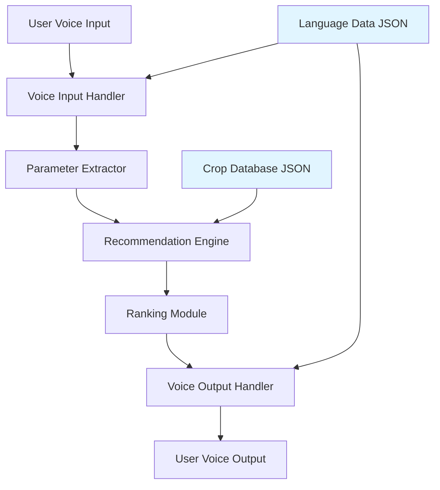

# Design Document: Offline Crop Recommendation System

## Overview

The Offline Crop Recommendation System is designed as a modular, offline-first application that provides intelligent crop suggestions to farmers. The system architecture emphasizes simplicity, performance on low-end devices, and complete offline operation. It integrates with Village AI's existing voice interaction infrastructure while introducing new recommendation logic and data management components.

The system follows a pipeline architecture: voice input → parameter extraction → recommendation generation → ranking → voice output. All components operate on locally stored data with no external dependencies.

**Critical Design Principle**: All components operate fully offline with zero network calls. The system must function completely without internet connectivity, relying solely on local JSON data and in-memory processing.

## Architecture

### High-Level Architecture



### Component Architecture

The system consists of five primary components:

1. **Voice Input Handler**: Interfaces with existing `voice.py` to capture and transcribe speech
2. **Parameter Extractor**: Parses transcribed text to extract soil type, water availability, and season
3. **Recommendation Engine**: Core logic that matches input parameters against crop database
4. **Ranking Module**: Calculates suitability and profit scores, produces final ranking
5. **Voice Output Handler**: Converts recommendations to speech in the user's language

### Integration Points

- Integrates with existing `voice.py` for speech-to-text and text-to-speech
- Extends `logic/crop_logic.py` with new recommendation algorithms
- Uses `logic/language_logic.py` for multi-language support
- Reads from `data/crops.json` for crop information
- Reads from `data/languages.json` for translations

## Components and Interfaces

### 1. Parameter Extractor

**Purpose**: Extract structured parameters from natural language voice input.

**Interface**:
```python
class ParameterExtractor:
    def extract_parameters(self, transcribed_text: str, language: str) -> Dict[str, Optional[str]]:
        """
        Extract soil type, water availability, and season from text.
        
        Args:
            transcribed_text: The transcribed voice input
            language: User's selected language code
            
        Returns:
            Dictionary with keys: 'soil_type', 'water_availability', 'season'
            Values are None if not found in input
        """
        pass
    
    def get_missing_parameters(self, params: Dict[str, Optional[str]]) -> List[str]:
        """
        Identify which required parameters are missing.
        
        Returns:
            List of missing parameter names
        """
        pass
```

**Implementation Details**:
- Uses keyword matching with language-specific dictionaries
- Supports synonyms and common variations (e.g., "rainy season" → "monsoon")
- Case-insensitive matching
- Returns structured dictionary with None for missing values

### 2. Recommendation Engine

**Purpose**: Query crop database and generate suitable crop recommendations with explainable reasoning.

**Interface**:
```python
class RecommendationEngine:
    def __init__(self, crop_database: CropDatabase):
        self.crop_database = crop_database
    
    def get_recommendations(
        self, 
        soil_type: str, 
        water_availability: str, 
        season: str
    ) -> List[CropRecommendation]:
        """
        Generate crop recommendations based on input parameters.
        
        Args:
            soil_type: Type of soil (e.g., 'clay', 'loam', 'sandy')
            water_availability: Water access level (e.g., 'high', 'medium', 'low')
            season: Agricultural season (e.g., 'kharif', 'rabi', 'zaid')
            
        Returns:
            List of CropRecommendation objects with suitability scores and reasons
        """
        pass
    
    def calculate_suitability_score(
        self, 
        crop: Crop, 
        soil_type: str, 
        water_availability: str, 
        season: str
    ) -> float:
        """
        Calculate how well a crop matches the given parameters.
        
        Returns:
            Suitability score between 0.0 and 1.0
        """
        pass
    
    def generate_reasons(
        self,
        crop: Crop,
        soil_type: str,
        water_availability: str,
        season: str
    ) -> List[str]:
        """
        Generate human-readable explanations for why a crop is recommended.
        
        Returns:
            List of reason strings explaining the recommendation
        """
        pass
```

**Implementation Details**:
- Loads all crops from database
- For each crop, calculates suitability score using weighted formula:
  - Soil compatibility: 40%
  - Water requirement match: 30%
  - Seasonal appropriateness: 30%
- Returns all crops with suitability > 0.3 (configurable threshold)
- **Explainable AI**: Generates human-readable reasons for each recommendation:
  - "Soil match: [crop] grows well in [soil_type] soil"
  - "Water match: [crop] requires [water_level] water, matching your [water_availability]"
  - "Season match: [crop] is suitable for [season] season"
  - Reasons are generated based on which parameters matched and contributed to the suitability score

### 3. Ranking Module

**Purpose**: Rank crops by combined suitability and profitability.

**Interface**:
```python
class RankingModule:
    def rank_crops(
        self, 
        recommendations: List[CropRecommendation]
    ) -> List[CropRecommendation]:
        """
        Rank crops by combined score of suitability and profit.
        
        Args:
            recommendations: List of crop recommendations with suitability scores
            
        Returns:
            Sorted list with highest-ranked crops first
        """
        pass
    
    def calculate_combined_score(
        self, 
        suitability_score: float, 
        profit_estimate: float
    ) -> float:
        """
        Calculate combined score from suitability and profit.
        
        Formula: (suitability * 0.7) + (normalized_profit * 0.3)
        
        Returns:
            Combined score between 0.0 and 1.0
        """
        pass
```

**Implementation Details**:
- Normalizes profit estimates to 0-1 scale using min-max normalization
- Combines suitability (70%) and normalized profit (30%)
- Sorts by combined score in descending order
- Breaks ties using alphabetical crop name ordering

### 4. Voice Output Formatter

**Purpose**: Format recommendations for voice output in user's language.

**Interface**:
```python
class VoiceOutputFormatter:
    def format_recommendations(
        self, 
        recommendations: List[CropRecommendation], 
        language: str, 
        top_n: int = 3
    ) -> str:
        """
        Format top N recommendations as speakable text.
        
        Args:
            recommendations: Ranked list of recommendations
            language: User's language code
            top_n: Number of top recommendations to include
            
        Returns:
            Formatted text ready for text-to-speech
        """
        pass
    
    def format_single_recommendation(
        self, 
        recommendation: CropRecommendation, 
        rank: int, 
        language: str
    ) -> str:
        """
        Format a single recommendation with rank, name, and reason.
        
        Returns:
            Formatted text for one recommendation
        """
        pass
```

**Implementation Details**:
- Translates crop names using language data
- Formats output as: "Rank [N]: [Crop Name]. Suitable because [reasons]. Expected profit: [amount]"
- Limits to top 3 recommendations by default
- Handles empty recommendation lists with appropriate message

### 5. Crop Database

**Purpose**: Manage local JSON storage and provide crop data access.

**Interface**:
```python
class CropDatabase:
    def load(self, filepath: str) -> None:
        """Load crop data from JSON file into memory."""
        pass
    
    def get_all_crops(self) -> List[Crop]:
        """Return all crops in database."""
        pass
    
    def get_crop_by_name(self, name: str) -> Optional[Crop]:
        """Retrieve specific crop by name."""
        pass
    
    def validate_soil_type(self, soil_type: str) -> bool:
        """Check if soil type exists in database."""
        pass
    
    def validate_water_availability(self, water_availability: str) -> bool:
        """Check if water availability level exists in database."""
        pass
    
    def validate_season(self, season: str) -> bool:
        """Check if season exists in database."""
        pass
```

**Implementation Details**:
- Loads JSON on initialization
- Caches all data in memory for fast access
- Provides validation methods for input parameters
- Handles missing or corrupted JSON files gracefully

## Data Models

### Crop Model

```python
@dataclass
class Crop:
    name: str
    soil_types: List[str]  # Compatible soil types
    water_requirement: str  # 'high', 'medium', 'low'
    seasons: List[str]  # Suitable seasons
    profit_estimate: float  # Expected profit per acre in INR
    growth_duration_days: int
    translations: Dict[str, str]  # Language code -> translated name
```

### CropRecommendation Model

```python
@dataclass
class CropRecommendation:
    crop: Crop
    suitability_score: float  # 0.0 to 1.0
    combined_score: float  # 0.0 to 1.0
    reasons: List[str]  # Why this crop is recommended
```

### JSON Data Structure

**crops.json**:
```json
{
  "crops": [
    {
      "name": "rice",
      "soil_types": ["clay", "loam", "alluvial"],
      "water_requirement": "high",
      "seasons": ["kharif", "monsoon"],
      "profit_estimate": 45000,
      "growth_duration_days": 120,
      "translations": {
        "te": "వరి",
        "ta": "அரிசி",
        "hi": "चावल",
        "kn": "ಅಕ್ಕಿ",
        "en": "rice"
      }
    }
  ],
  "soil_types": ["clay", "loam", "sandy", "black", "red", "alluvial"],
  "water_levels": ["high", "medium", "low", "irrigated", "rainfed"],
  "seasons": ["kharif", "rabi", "zaid", "summer", "monsoon", "winter"]
}
```


## Correctness Properties

A property is a characteristic or behavior that should hold true across all valid executions of a system—essentially, a formal statement about what the system should do. Properties serve as the bridge between human-readable specifications and machine-verifiable correctness guarantees.

### Property Reflection

After analyzing all acceptance criteria, I identified the following redundancies:
- Properties 2.3 and 2.4 overlap: 2.4 (profit prioritization for similar scores) is subsumed by 2.3 (ranking by combined score formula)
- Properties 6.1 and 6.2 overlap: 6.2 (specific weights) is part of testing 6.1 (suitability calculation formula)
- Properties 6.3 and 6.4 overlap: 6.4 (descending order) is the natural result of testing 6.3 (combined score ranking)
- Properties 1.2 and parameter extraction can be consolidated into a single comprehensive property
- Error handling properties 7.1, 7.2, 7.3 can be consolidated into a single property about invalid parameter handling

The following properties provide unique validation value and comprehensive coverage:

### Property 1: Parameter Extraction Completeness
*For any* transcribed text containing soil type, water availability, or season keywords in any supported language, the Parameter Extractor should correctly identify and extract all present parameters into the structured format.

**Validates: Requirements 1.2**

### Property 2: Missing Parameter Detection
*For any* parameter dictionary with one or more None values, the System should identify exactly which parameters are missing and generate appropriate voice prompts for each missing parameter.

**Validates: Requirements 1.3**

### Property 3: Error Message Generation
*For any* voice input processing failure, the System should produce a spoken error message in the user's selected language and provide retry instructions.

**Validates: Requirements 1.5**

### Property 4: Database Query Execution
*For any* valid combination of soil type, water availability, and season, the Recommendation Engine should query the Crop Database and return a non-empty list of crops (or an empty list if no crops match).

**Validates: Requirements 2.1**

### Property 5: Suitability Score Calculation
*For any* crop and input parameters, the calculated suitability score should be between 0.0 and 1.0, and should follow the formula: (soil_compatibility × 0.4) + (water_match × 0.3) + (season_match × 0.3).

**Validates: Requirements 6.1, 6.2**

### Property 6: Combined Score Ranking
*For any* list of crop recommendations, when ranked by the Ranking Module, the output should be sorted in descending order by combined score, where combined score = (suitability × 0.7) + (normalized_profit × 0.3).

**Validates: Requirements 2.3, 2.4, 6.3, 6.4**

### Property 7: Tie-Breaking Consistency
*For any* two crops with identical combined scores, the System should maintain consistent alphabetical ordering by crop name across all ranking operations.

**Validates: Requirements 6.5**

### Property 8: Top-N Recommendation Count
*For any* recommendation request where at least N matching crops exist, the System should return at least N recommendations (default N=3).

**Validates: Requirements 2.5**

### Property 9: Fallback Alternatives
*For any* input parameters that produce zero exact matches, the System should return the closest alternative crops (those with highest suitability scores above 0.0) along with explanations.

**Validates: Requirements 2.6**

### Property 10: Database Loading Completeness
*For any* valid crops.json file, after the Crop Database loads, all crops defined in the JSON should be retrievable via get_all_crops() and get_crop_by_name().

**Validates: Requirements 3.2**

### Property 11: Output Format Completeness
*For any* crop recommendation, the formatted voice output should contain the crop name (in the selected language), suitability reasons, and profit estimate.

**Validates: Requirements 4.2**

### Property 12: Ranking Order Preservation
*For any* ranked list of recommendations, the voice output should present crops in the same order as the ranking, with rank numbers matching positions.

**Validates: Requirements 4.4**

### Property 13: Multi-Language Input Processing
*For any* valid input text in Telugu, Tamil, Hindi, Kannada, or English, the System should successfully extract parameters without language-specific failures.

**Validates: Requirements 5.1**

### Property 14: Multi-Language Output Generation
*For any* recommendation and any supported language code, the Voice Output Formatter should produce valid output text with crop names translated to the specified language.

**Validates: Requirements 5.2**

### Property 15: Language Consistency
*For any* session with a selected language, all voice prompts, error messages, and recommendations should use that same language until explicitly changed.

**Validates: Requirements 5.3**

### Property 16: Translation Completeness
*For any* crop in the database, translations should exist for all five supported languages (Telugu, Tamil, Hindi, Kannada, English).

**Validates: Requirements 5.4**

### Property 17: Context Preservation Across Language Switch
*For any* active recommendation session, switching the language should preserve the current input parameters and recommendation results, only changing the language of the output.

**Validates: Requirements 5.5**

### Property 18: Invalid Parameter Error Handling
*For any* unrecognized soil type, water availability level, or season, the System should generate an error message that includes the invalid value and suggests valid alternatives from the database.

**Validates: Requirements 7.1, 7.2, 7.3**

### Property 19: Database Load Failure Handling
*For any* scenario where the Crop Database fails to load (missing file, corrupted JSON, etc.), the System should produce an error message and block all recommendation attempts until the database is successfully loaded.

**Validates: Requirements 7.4**

### Property 20: Voice Processing Error Recovery
*For any* voice input that cannot be processed (empty, noise, unrecognizable), the System should provide spoken feedback in the user's language and allow retry without crashing.

**Validates: Requirements 7.5**

## Error Handling

### Error Categories

1. **Input Validation Errors**
   - Invalid or unrecognized soil types
   - Invalid or unrecognized water availability levels
   - Invalid or unrecognized seasons
   - Missing required parameters
   - Response: Provide specific error message with valid options, allow retry

2. **Database Errors**
   - Missing crops.json file
   - Corrupted or invalid JSON format
   - Empty database
   - Response: Log error, display user-friendly message, prevent recommendations

3. **Voice Processing Errors**
   - Speech-to-text failure
   - Text-to-speech failure
   - Unrecognizable audio input
   - Response: Provide spoken error message, allow retry

4. **System Errors**
   - Memory allocation failures
   - Unexpected exceptions in recommendation logic
   - Response: Log error with stack trace, provide generic error message to user

### Error Handling Strategy

- All errors should produce user-friendly messages in the selected language
- System should never crash; all exceptions should be caught and handled
- Errors should be logged for debugging purposes
- Users should always have a clear path to retry or correct their input
- Database errors should be detected at startup, not during recommendation

### Graceful Degradation

- If translations are missing for a language, fall back to English
- If profit data is missing for a crop, use median profit value
- If no crops match parameters, return closest alternatives (suitability > 0.0)
- If voice output fails, provide text output as fallback

## Testing Strategy

### Dual Testing Approach

The system will use both unit testing and property-based testing to ensure comprehensive coverage:

**Unit Tests**: Focus on specific examples, edge cases, and integration points
- Example: Test parameter extraction with specific Telugu phrase "నల్ల మట్టి" (black soil)
- Example: Test ranking with exactly 3 crops having identical scores
- Example: Test database loading with a minimal valid JSON file
- Example: Test error message for specific invalid input "xyz soil"

**Property-Based Tests**: Verify universal properties across randomized inputs
- Generate random crop data and verify suitability calculations
- Generate random parameter combinations and verify ranking consistency
- Generate random language inputs and verify extraction works
- Generate random invalid inputs and verify error handling

### Property-Based Testing Configuration

**Library Selection**: 
- Python: Use `hypothesis` library for property-based testing
- Each property test should run minimum 100 iterations
- Use `@given` decorators with appropriate strategies

**Test Tagging Format**:
Each property-based test must include a comment tag:
```python
# Feature: offline-crop-recommendation, Property 6: Combined Score Ranking
@given(recommendations=st.lists(crop_recommendation_strategy(), min_size=1))
def test_ranking_descending_order(recommendations):
    ranked = ranking_module.rank_crops(recommendations)
    scores = [r.combined_score for r in ranked]
    assert scores == sorted(scores, reverse=True)
```

### Test Coverage Requirements

1. **Parameter Extraction**: Test all supported languages with various phrasings
2. **Recommendation Engine**: Test all combinations of soil/water/season
3. **Ranking Module**: Test with varying numbers of crops and score distributions
4. **Voice Output**: Test formatting in all languages
5. **Error Handling**: Test all error categories with various invalid inputs
6. **Database Operations**: Test loading, querying, and validation
7. **Integration**: Test complete flow from voice input to voice output

### Testing on Low-End Devices

- Performance tests should run on representative low-end hardware
- Memory usage should be monitored during test execution
- Database loading time should be measured and validated
- Recommendation generation time should be measured and validated

### Edge Cases to Test

- Empty database
- Database with single crop
- All crops having identical scores
- No crops matching parameters
- Parameters with extreme values
- Very long crop names or descriptions
- Missing translations for some crops
- Simultaneous language switches
- Rapid repeated queries
